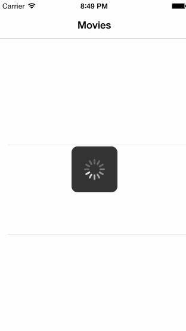
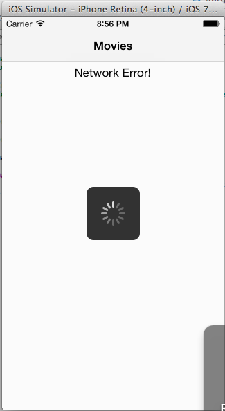

This is an Ios application for displaying the latest box office movies using the RottenTomatoes API.
Time spent: 6 hours spent in total

Used cocoapods and AFNetworking library for async loading of images

Completed user stories:

* [x] Required: User can view a list of latest box office movies including title, poster image and synopsis
* [x] Required: User can click on a movie in the list to bring up a details page
* [x] Required: User can pull to refresh to get latest content
* [x] Required: If the user is not connected, it shows the network error bar
* [x] Required: Loading spinner shows while the contents is being fetched and downloaded

GIF created with [LiceCap](http://www.cockos.com/licecap/).

